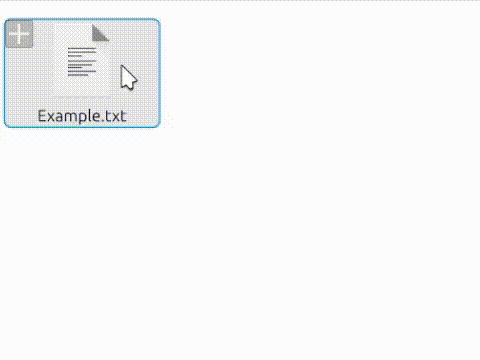
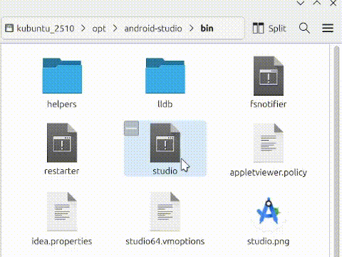
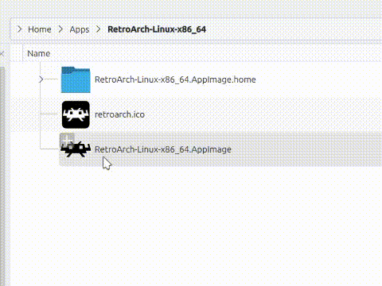

   

# Dolphin Create Launcher

Create `.desktop` launchers directly from Dolphin's context menu.

This service menu adds:

- **Create Launcher Here**
- **Create Launcher on Desktop**
- **Create Launcher on App Launcher Menu**

It automatically:

- Detects executables
- Uses `xdg-open` for normal files
- Prevents chaining `.desktop` files
- Generates safe filenames
- Avoids name collisions
- Applies correct permissions
- Uses appropriate file icons

Compatible with **KDE Plasma 5 and 6**.

---

## Demo

### Create launcher from a .txt file (local folder)



### Create launcher on Desktop + customize icon



### Create launcher on App Launcher Menu + customize



---

## Installation

### Option 1 — Install via .deb (recommended)

Download the latest `.deb` from Releases and install:

```bash
sudo dpkg -i dolphin-create-launcher_*.deb
```

### Option 2 - Manual install (user only)

Install
```bash
./install/install-user.sh
```

Uninstall
```bash
./install/uninstall-user.sh
```

---

## Requirements

- KDE Plasma
- Dolphin
- xdg-utils

---

## Contributing

Contributions are welcome!

### Add translations

You can contribute translations by editing:
`servicemenu/create-launcher.desktop`
Add your language like:
`Name[es]=Crear lanzador aquí`

If the project grows, we will migrate to gettext (.po) based translations.

---

## Roadmap

- Better icon detection
- Thumbnail support for image-based launchers
- Optional terminal launcher detection
- Localization via gettext

---

## License

MIT
